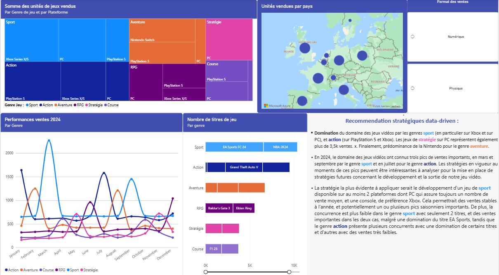

# video-game-sales-dashboard-powerbi
Interactive Power BI dashboard analyzing 2024 video game sales: trends by platform, genre and region.
# Video Game Sales Dashboard 2024 (Power BI)

An interactive Power BI dashboard exploring video game sales in 2024.

## Overview
This project turns raw sales data into a clear, interactive dashboard that makes it easy to identify trends and compare performance across platforms, genres and regions.

## Key features
- Interactive filters to explore the data
- KPIs and visualizations highlighting top-performing titles and categories
- Comparison of sales across platforms, genres and regions

## Files
- `Shana_CLOSSE_dashboard_ventes_jeuxvideo.pbix`: Power BI source file (requires Power BI Desktop)
- `apercu-dashboard.png`: dashboard preview
- PDF export of the dashboard

## Tools
Power BI, DAX, data cleaning and visualization

## Related project
The same topic was also built with Flourish, using a slightly different dataset: [video-game-sales-dashboard-2024](https://github.com/closseshana/video-game-sales-dashboard-2024).

## Author
Shana Closse, Master's student in Digital Communication and Data Analysis (Sorbonne Nouvelle)
